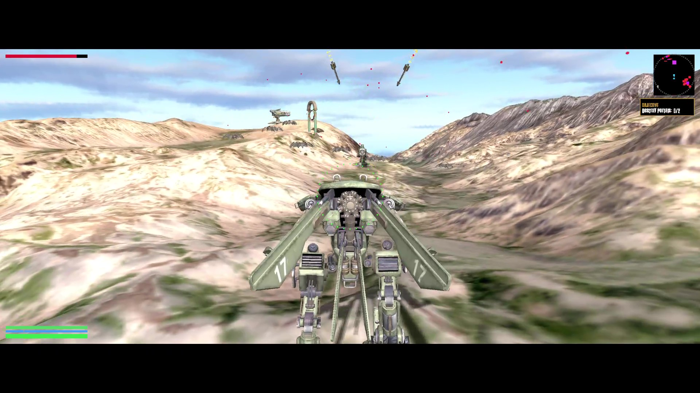
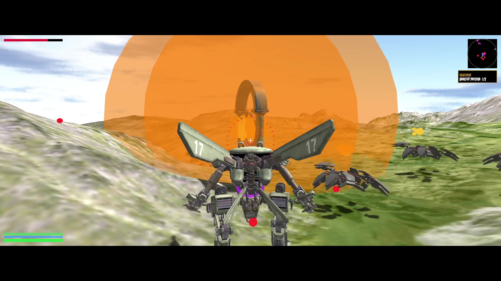
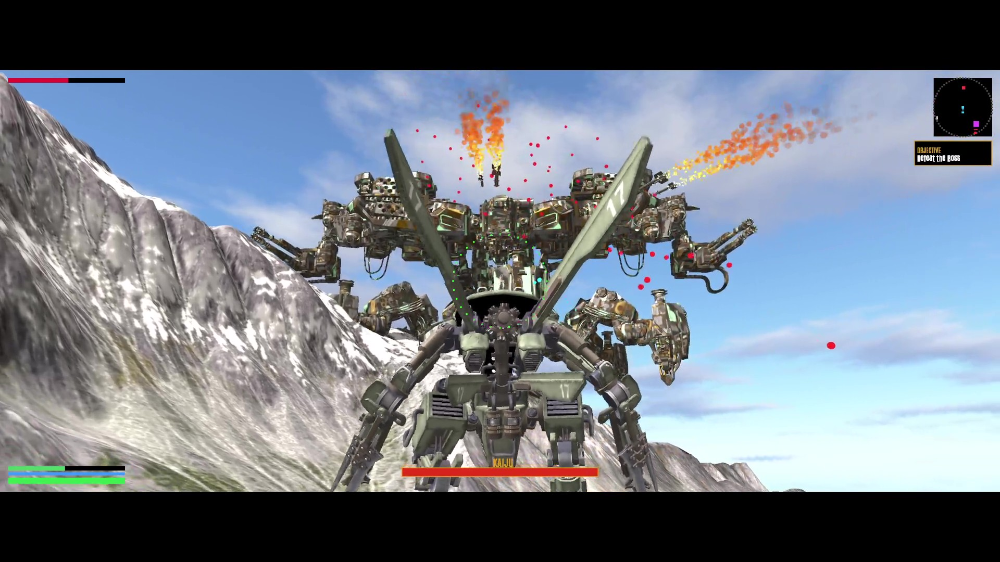

# Mecha Fight

**Mecha Fight** is a 3D action game developed as a course project for 2110584.68 at the Faculty of Engineering, Chulalongkorn University (CEDT) By Tanit Yodsirawong 6633104921.

Designed to demonstrate the fundamentals of computer graphics, this project utilizes Basic OpenGL to render an immersive combat environment. Players pilot a high-tech Mecha unit, tasked with defending humanity against an onslaught of hostile Alien Mechs.

## itch.io Page
https://xunflowerrr.itch.io/mecha-fight

## Preview

## Video Preview

<video width="640" height="360" controls>
  <source src="https://youtu.be/iAAq0SiPZKM?si=wnZGwxaAzWnDAgwY" type="video/mp4">
  Your browser does not support the video tag.
</video>

## Features

- Immersive 3D combat gameplay
- High-tech Mecha piloting
- Defense against Alien Mech onslaught
- OpenGL-based rendering

## Credits

We extend our gratitude to the community for providing the following assets:

### 3D Models

| Asset | Description | Author | License |
|-------|-------------|--------|---------|
| Boss Model (Deathbringer) | "Deathbringer from Horizon Zero Dawn" | [Théo Domon](https://skfb.ly/6sNGn) | [CC BY-NC](http://creativecommons.org/licenses/by-nc/4.0/) |
| Player Model | "Animated Mech - Marceline Sentinel Armor (Marcy)" | [RainOnTheMoon](https://skfb.ly/p8qs7) | [CC BY](http://creativecommons.org/licenses/by/4.0/) |
| Spider Alien Mech Model | "Episode 71 - Hexapod Robot" | [dartuchiwa](https://skfb.ly/ooRQw) | [CC BY](http://creativecommons.org/licenses/by/4.0/) |
| Laser Gun Model | "Energy gun" | [DailyArt](https://skfb.ly/onL98) | [CC BY](http://creativecommons.org/licenses/by/4.0/) |
| Missile Model | "R-73 Vympel" | [Jeyhun1985](https://skfb.ly/ovwOM) | [CC BY](http://creativecommons.org/licenses/by/4.0/) |
| Portal Gate Model | "Energy Gate - Classical Style" | [Samuel F. Johanns (Oneironauticus)](https://skfb.ly/oNn8o) | [CC BY](http://creativecommons.org/licenses/by/4.0/) |
| Terrain Model | "Mountain Range 01" | [solararchitect](https://skfb.ly/orPGW) | [CC BY](http://creativecommons.org/licenses/by/4.0/) |

### Textures

- **Skybox Textures**: "Sky Textures" by [Bumbadida](https://bumbadida.itch.io/skybox-textures-sdr)

### Sound Effects

The following sound effects were sourced from [Pixabay](https://pixabay.com/):

- [3-legged robot walker](https://pixabay.com/sound-effects/3-legged-robot-walker-86726/)
- [Big cine boom sound effect](https://pixabay.com/sound-effects/big-cine-boom-sound-effect-245851/)
- [Big robot footstep 004](https://pixabay.com/sound-effects/big-robot-footstep-004-346797/)
- [Big robot footstep 010](https://pixabay.com/sound-effects/big-robot-footstep-010-426482/)
- [Exploding building 1](https://pixabay.com/sound-effects/exploding-building-1-185114/)
- [Large rocket engine](https://pixabay.com/sound-effects/large-rocket-engine-86240/)
- [Laser gun](https://pixabay.com/sound-effects/laser-gun-105918/)
- [Little robot sound](https://pixabay.com/sound-effects/little-robot-sound-84657/)
- [Long whoosh](https://pixabay.com/sound-effects/long-whoosh-194554/)
- [Medium explosion](https://pixabay.com/sound-effects/medium-explosion-40472/)
- [Metal knock 2](https://pixabay.com/sound-effects/metal-knock-2-103060/)
- [Robot tank](https://pixabay.com/sound-effects/robot-tank-34600/)
- [Sci-fi gun shoot 1](https://pixabay.com/sound-effects/scifi-gun-shoot-1-266417/)
- [Sound design elements impact sfx ps 093](https://pixabay.com/sound-effects/sound-design-elements-impact-sfx-ps-093-369575/)

### Music

Music tracks provided by [SUNO](https://suno.com/) under a non-commercial license.

## License

This project is licensed under the CC BY-NC 4.0 License - see the [LICENSE.md](LICENSE.md) file for details.
